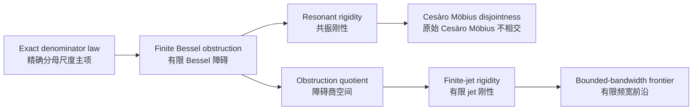

# Exact Denominator Asymptotics, Finite-Jet Rigidity, and Möbius Disjointness

**English / 中文**

This repository contains the current paper draft and the core research notes for a project on the original Cesàro form of Sarnak's conjecture for a class of two-step triangular skew products.

本仓库包含当前论文主稿以及直接支撑论文的核心研究笔记。项目主线是：围绕原始 Cesàro 版 Sarnak 猜想，研究一类两步三角型 skew product，并发展其中可显式写出的分母尺度机制。

## Model / 模型

We study the system

```text
T_h(x,y,z) = (x + alpha, y + beta sin(2πx), z + h(x,y))
```

on the three-torus, with irrational `alpha` and finite-band real trigonometric `h`.

研究对象是三维环面上的两步三角型系统，其中 `alpha` 无理，`h` 为有限带实三角多项式。

## What Is New / 核心贡献

This project is not centered on a new abstract criterion. Its contribution is a concrete mechanism for this specific two-step model.

这项工作的重点不是提出一个抽象的新判据，而是为这个特定两步模型建立一套可显式计算的机制。

- Exact denominator-scale asymptotics for top cocycle blocks along continued-fraction denominators.
- A finite Bessel obstruction vector controlling the main term.
- Quantitative rigidity on the resonant variety, leading to original Cesàro Möbius disjointness.
- A finite-dimensional obstruction quotient and explicit obstruction geometry.
- A finite-jet rigidity program based on parity-adapted Lommel / central-factorial structures.

- 在连分数分母时刻上，对顶层 cocycle block 建立精确主项展开。
- 主项由一个有限维 Bessel 障碍向量控制。
- 在共振簇上推出定量刚性，并进一步得到原始 Cesàro 版 Möbius 不相交。
- 构造有限维障碍商空间，并分析其几何结构。
- 建立基于 Lommel / central-factorial 结构的 finite-jet rigidity 方案。

## Why It Matters / 为什么值得关注

For this two-step model, the denominator-scale obstruction is visible and computable. That makes it possible to move beyond soft rigidity and describe a concrete geometric mechanism behind Möbius disjointness.

在这个两步模型中，分母尺度上的障碍不是“存在性”对象，而是可以显式写出的。这使得问题不再停留在软性的 rigidity 路线，而能进入一种可见、可计算、可几何化的机制理论。



## Current Paper Structure / 当前论文主线

The present draft is organized around four outputs.

当前主稿围绕四条输出组织：

1. Exact denominator asymptotics.
2. Möbius disjointness on the resonant variety.
3. Obstruction geometry for finite-band cocycles.
4. Finite-jet rigidity and the bounded-bandwidth frontier.

1. 精确分母渐近。
2. 共振簇上的 Möbius 不相交。
3. 有限带 cocycle 的障碍几何。
4. finite-jet rigidity 及有限频宽前沿。

## Main Files / 主要文件

- [paper.tex](paper.tex): current LaTeX source
- [paper.pdf](paper.pdf): compiled draft
- [notes/](notes): research notes directly supporting the present theorem package and current frontier

## Current Frontier / 当前前沿

The main open direction retained in this repository is no longer support-by-support elimination. It is the bounded-bandwidth amplitude-lifting problem for normalized Prüfer fibers, especially the resultant / subresultant geometry of lower-degree boundary strata.

当前保留在仓库中的主要前沿，已经不再是逐个支撑族做排除，而是 bounded-bandwidth 条件下 normalized Prüfer fiber 的 amplitude-lifting 问题，特别是低阶边界层上的 resultant / subresultant 几何。

## Citation and Contact / 引用与联系

If you want to discuss the project, the current contact is:

```text
Shun Hu
The Chinese University of Hong Kong, Shenzhen
shunhu@link.cuhk.edu.cn
```
